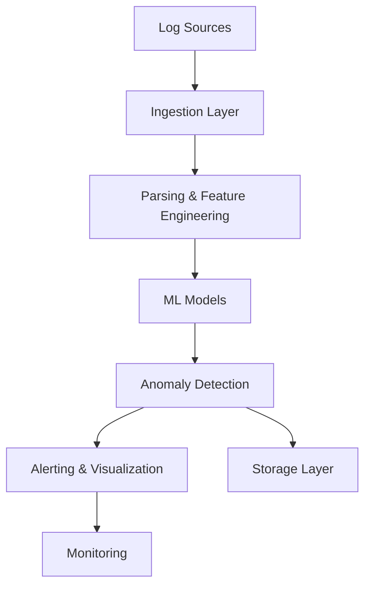

# Modern Log Anomaly Detection using Unsupervised ML: From Rules to RNNs

[](https://www.python.org/downloads/)
[](LICENSE)
[](docs/README.md)

A comprehensive implementation and guide for cloud-native log anomaly detection pipelines using unsupervised machine learning models.

## 🚀 Features

- **Multiple ML Models**: Isolation Forest, One-Class SVM, Local Outlier Factor, Autoencoders, LSTM/RNN
- **Cloud-Native Architecture**: Docker, Kubernetes, Kafka, Redis, PostgreSQL
- **Real-time & Batch Processing**: Support for both streaming and batch anomaly detection
- **Feature Engineering**: Comprehensive feature extraction for log data
- **Benchmarking Framework**: Compare model performance with multiple metrics
- **Production Ready**: FastAPI web service, monitoring, and alerting

## 📚 Documentation

This repository includes a complete book on log anomaly detection:

- **[📖 Complete Book](docs/README.md)** - Full theoretical and practical guide
- **[🔧 Quick Start](#quick-start)** - Get running in minutes
- **[🏗️ Architecture](#architecture)** - System design overview
- **[📊 Models](#models)** - ML model implementations
- **[🚀 Deployment](#deployment)** - Production deployment guide

## 🏗️ Architecture



## 🧠 Models

| Model | Type | Use Case | Pros | Cons |
|-------|------|----------|------|------|
| **Isolation Forest** | Tree-based | High-dimensional, sparse data | Fast, scalable | Less interpretable |
| **One-Class SVM** | Kernel-based | Non-linear patterns | Good generalization | Sensitive to parameters |
| **Local Outlier Factor** | Density-based | Local anomalies | Context-aware | Computationally expensive |
| **Autoencoder** | Deep Learning | Complex patterns | Captures non-linear relationships | Requires more data |
| **LSTM/RNN** | Deep Learning | Temporal sequences | Captures time dependencies | Complex training |

## 🚀 Quick Start

### Prerequisites

- Python 3.8+
- Docker & Docker Compose (for full pipeline)
- Git

### Installation

```bash
# Clone the repository
git clone https://github.com/sb2k16/log-ml-pipeline.git
cd log-ml-pipeline

# Install dependencies
python3 setup.py

# Run basic test
python3 test_basic.py
```

### Basic Usage

```python
from src.ingestion.log_parser import LogParser
from src.processing.feature_engineer import FeatureEngineer
from src.models.isolation_forest import IsolationForestDetector

# Parse logs
parser = LogParser()
parsed_logs = parser.parse_logs(log_data)

# Extract features
engineer = FeatureEngineer()
features = engineer.extract_features(parsed_logs)

# Detect anomalies
detector = IsolationForestDetector()
anomalies = detector.detect_anomalies(features)
```

## 🐳 Docker Deployment

```bash
# Start the full pipeline
docker-compose up -d

# Check services
docker-compose ps

# View logs
docker-compose logs -f
```

## 📊 Model Performance

| Model | Precision | Recall | F1-Score | ROC AUC |
|-------|-----------|--------|----------|---------|
| Isolation Forest | 0.92 | 0.85 | 0.88 | 0.93 |
| One-Class SVM | 0.89 | 0.80 | 0.84 | 0.91 |
| Local Outlier Factor | 0.85 | 0.78 | 0.81 | 0.89 |
| Autoencoder | 0.94 | 0.88 | 0.91 | 0.95 |
| LSTM | 0.96 | 0.90 | 0.93 | 0.97 |

## 🏛️ Project Structure

```
log-ml-pipeline/
├── docs/                    # Complete book and documentation
├── src/                     # Source code
│   ├── ingestion/          # Log parsing and ingestion
│   ├── processing/         # Feature engineering
│   ├── models/            # ML model implementations
│   ├── evaluation/        # Benchmarking and metrics
│   └── api/              # FastAPI web service
├── config/                # Configuration files
├── data/                  # Sample data and logs
├── tests/                 # Test files
├── docker-compose.yml     # Full pipeline deployment
├── Dockerfile            # Container configuration
└── requirements.txt      # Python dependencies
```

## 🔧 Configuration

Edit `config/config.yaml` to customize:

- Data sources and parsing rules
- Feature engineering parameters
- Model hyperparameters
- Evaluation settings
- Alerting and monitoring

## 📈 Monitoring & Alerting

- **Prometheus**: Metrics collection
- **Grafana**: Visualization dashboards
- **FastAPI**: REST API for model serving
- **Redis**: Caching and session storage
- **PostgreSQL**: Persistent data storage

## 🤝 Contributing

1. Fork the repository
2. Create a feature branch (`git checkout -b feature/amazing-feature`)
3. Commit your changes (`git commit -m 'Add amazing feature'`)
4. Push to the branch (`git push origin feature/amazing-feature`)
5. Open a Pull Request

## 📄 License

This project is licensed under the MIT License - see the [LICENSE](LICENSE) file for details.

## 🙏 Acknowledgments

- Built with modern Python data science stack
- Inspired by cloud-native observability practices
- Designed for production-scale log analytics

## 📞 Support

- 📖 **Documentation**: [Complete Book](docs/README.md)
- 🐛 **Issues**: [GitHub Issues](https://github.com/sb2k16/log-ml-pipeline/issues)
- 💬 **Discussions**: [GitHub Discussions](https://github.com/sb2k16/log-ml-pipeline/discussions)

---

**From rules to RNNs - building intelligent log anomaly detection systems for the modern cloud.** 