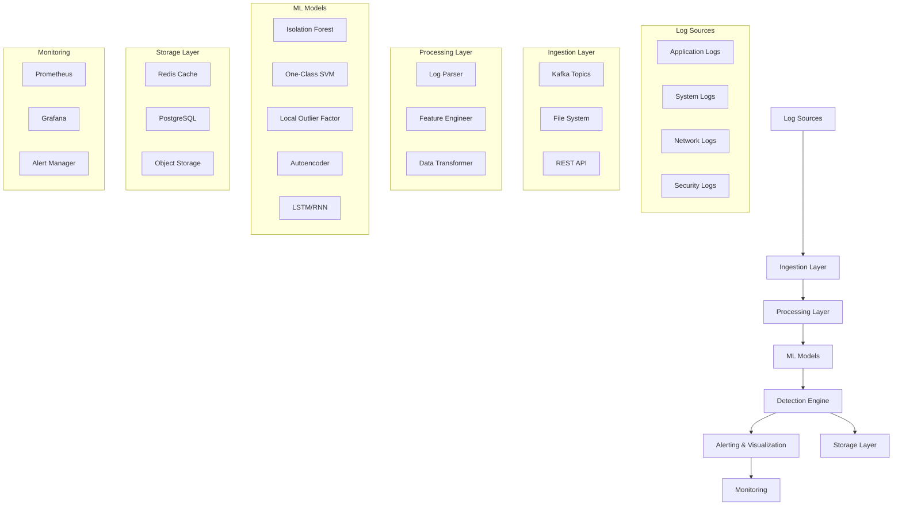

# System Architecture: Cloud-Native Log Anomaly Detection

## Overview

The log anomaly detection pipeline is designed as a cloud-native, microservices-based system that can scale horizontally and handle both real-time and batch processing of log data.

## High-Level Architecture



## Component Details

### 1. Log Sources
- **Application Logs**: Web servers, microservices, APIs
- **System Logs**: OS events, kernel messages, systemd logs
- **Network Logs**: Firewall, router, switch logs
- **Security Logs**: Authentication, authorization, audit logs

### 2. Ingestion Layer
- **Apache Kafka**: Real-time streaming for high-throughput log ingestion
- **File System**: Batch processing for historical log analysis
- **REST API**: Direct log submission for custom integrations

### 3. Processing Layer
- **Log Parser**: Extracts structured fields from raw log entries
- **Feature Engineer**: Transforms logs into ML-ready feature vectors
- **Data Transformer**: Normalizes and scales features for ML models

### 4. ML Models
- **Isolation Forest**: Fast, scalable tree-based anomaly detection
- **One-Class SVM**: Kernel-based boundary learning
- **Local Outlier Factor**: Density-based local anomaly detection
- **Autoencoder**: Deep learning for complex pattern recognition
- **LSTM/RNN**: Temporal sequence modeling for log streams

### 5. Detection Engine
- **Model Registry**: Manages model versions and metadata
- **Scoring Service**: Real-time anomaly scoring
- **Ensemble Methods**: Combines multiple model predictions
- **Threshold Management**: Dynamic alert thresholds

### 6. Storage Layer
- **Redis**: Caching and session management
- **PostgreSQL**: Persistent storage for logs and results
- **Object Storage**: Model artifacts and large datasets

### 7. Monitoring & Alerting
- **Prometheus**: Metrics collection and storage
- **Grafana**: Visualization and dashboards
- **Alert Manager**: Notification routing and deduplication

## Data Flow

### Real-Time Processing
```
Log Source → Kafka → Parser → Feature Engineer → ML Models → Detection → Alerting
```

### Batch Processing
```
Log Files → File Reader → Parser → Feature Engineer → ML Models → Results → Storage
```

## Deployment Options

### 1. Docker Compose (Development)
```yaml
services:
  - kafka
  - redis
  - postgresql
  - anomaly-detection
  - prometheus
  - grafana
```

### 2. Kubernetes (Production)
```yaml
# Namespaces
- monitoring
- logging
- ml-pipeline

# Deployments
- kafka-cluster
- redis-cluster
- postgresql-cluster
- anomaly-detection-api
- model-serving
```

### 3. Cloud-Native (AWS/GCP/Azure)
- **AWS**: EKS, MSK, ElastiCache, RDS, S3
- **GCP**: GKE, Pub/Sub, Cloud SQL, Cloud Storage
- **Azure**: AKS, Event Hubs, Azure Cache, Azure SQL

## Scalability Considerations

### Horizontal Scaling
- **Kafka**: Partition-based parallelism
- **ML Models**: Model replicas across nodes
- **API Services**: Load balancer distribution
- **Storage**: Read replicas and sharding

### Performance Optimization
- **Caching**: Redis for frequently accessed data
- **Batch Processing**: Efficient bulk operations
- **Model Optimization**: Quantization and pruning
- **Network Optimization**: Compression and batching

## Security Architecture

### Data Protection
- **Encryption**: TLS for data in transit, encryption at rest
- **Authentication**: JWT tokens, API keys
- **Authorization**: RBAC for service-to-service communication
- **Audit Logging**: Comprehensive access and change logs

### Network Security
- **VPC/Network Isolation**: Separate networks for different tiers
- **Firewall Rules**: Restrictive network policies
- **Service Mesh**: Istio/Linkerd for secure service communication

## Monitoring & Observability

### Metrics
- **Application Metrics**: Request rates, latencies, error rates
- **Infrastructure Metrics**: CPU, memory, disk, network
- **Business Metrics**: Detection rates, false positives, model performance

### Logging
- **Structured Logging**: JSON format with consistent fields
- **Log Aggregation**: Centralized log collection and analysis
- **Log Retention**: Configurable retention policies

### Tracing
- **Distributed Tracing**: Track requests across services
- **Performance Analysis**: Identify bottlenecks and optimization opportunities
- **Error Tracking**: Detailed error context and stack traces

## Disaster Recovery

### Backup Strategy
- **Database Backups**: Automated PostgreSQL backups
- **Model Artifacts**: Versioned model storage
- **Configuration**: Infrastructure as Code (IaC)

### Recovery Procedures
- **RTO (Recovery Time Objective)**: 4 hours
- **RPO (Recovery Point Objective)**: 1 hour
- **Failover**: Automated failover to secondary region

## Cost Optimization

### Resource Management
- **Auto-scaling**: Dynamic resource allocation
- **Spot Instances**: Cost-effective compute for batch processing
- **Storage Tiering**: Hot/warm/cold storage optimization

### Monitoring
- **Cost Alerts**: Budget monitoring and alerts
- **Resource Optimization**: Regular review and optimization
- **Right-sizing**: Match resources to actual usage patterns

---

**Next: [Model Integration](model_integration.md) →** 